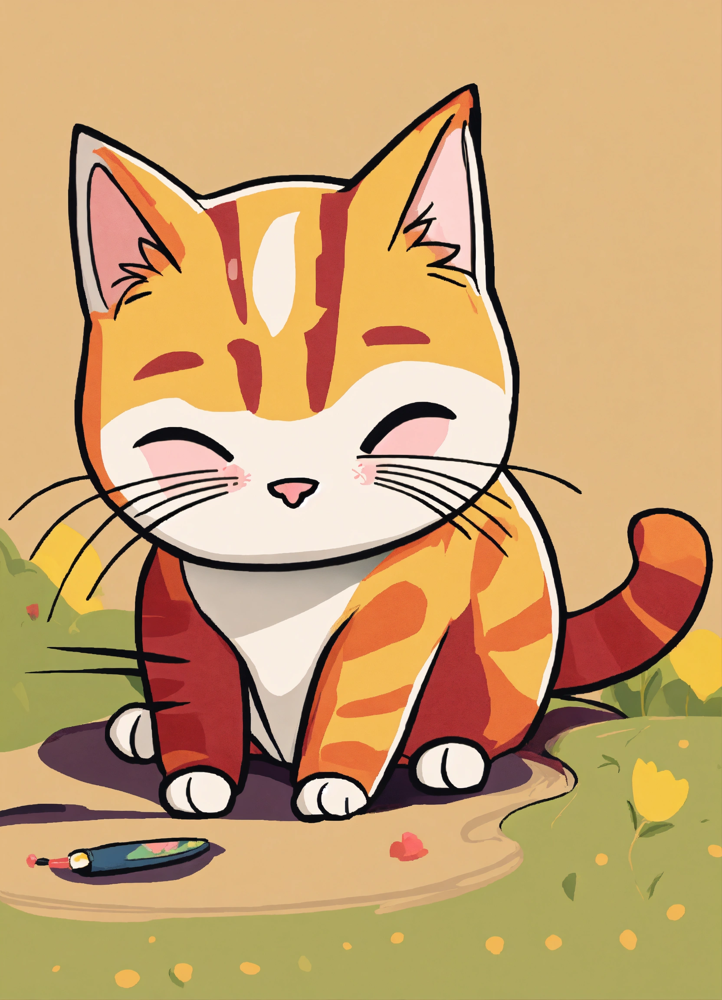

# A story about cats



##  Summer camp: Teaching my mom to code

### **Goals:**

- Teach her web development
- Keep her motivated for the coming weeks
- Create a positive feedback loop to share/correct code with her
- Pass time with my mom
- Most important: Have fun!

## Steps:

### Operating system:
- Install Ubuntu on the machine: mom using Ubuntu :white_check_mark:

### Tools:
- Have her installed ollama within the terminal on Ubuntu using ```curl```

### Web development:
- [First lesson: Learn HTML by Building a Cat Photo App](https://www.freecodecamp.org/learn/2022/responsive-web-design/) :white_check_mark:
